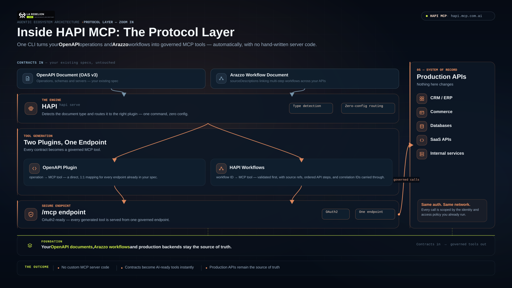

# HAPI MCP



Turn an OpenAPI-described API into an [MCP](https://modelcontextprotocol.io/)
server, or expose an [Arazzo](https://spec.openapis.org/arazzo/latest.html)
workflow as a higher-level MCP tool.

This is the public distribution repository for HAPI binaries, packages, and
end-user release artifacts. HAPI is a La Rebelion Labs product, alongside
[mcp.com.ai](https://mcp.com.ai), [clawne.me](https://clawne.me), and
[rebelion.la](https://rebelion.la).

## HAPI v1 beta

HAPI v1 is a major upgrade from the production-ready HAPI MCP 0.x release
line, which remains available in the
[legacy repository](https://github.com/la-rebelion/hapimcp). Version 1 adds a
plugin-based CLI and introduces **HAPI Workflows**: Arazzo workflows served as
MCP tools.

Use v1 beta releases for evaluation and integration testing. Keep using the
0.x `latest` Docker tag for production workloads until v1 reaches stable
release. Pin a `1.0.0-beta.*` version whenever repeatability matters.

| Need | HAPI v1 capability |
| --- | --- |
| Expose API operations as MCP tools | OpenAPI / HAPI MCP |
| Expose a business outcome as one MCP tool | Arazzo / HAPI Workflows |
| Use either document type from one entry command | `hapi serve` document detection |

## How it works

```text
OpenAPI document ──> HAPI ──> one MCP tool per API operation

Arazzo document ───> HAPI ──> one MCP tool per workflowId
                                └─ workflow steps call their documented APIs
```

With OpenAPI, an operation such as `getPet` becomes an MCP tool. HAPI can
proxy to an existing backend, so your API remains the source of truth for its
business logic, authentication, and data.

With HAPI Workflows, an Arazzo `workflowId` becomes an MCP tool. A workflow
can coordinate multiple documented OpenAPI operations—such as finding a
provider, checking availability, and booking an appointment—behind one
intentional tool call.

## Choose an installation

### Docker — recommended for trying HAPI v1

The `workflows` and `arazzo` tags point to the same HAPI v1 beta image.

```sh
docker pull hapimcp/hapi-cli:workflows
docker run --rm hapimcp/hapi-cli:workflows version
```

Use a pinned version instead of a moving tag in CI or shared environments:

```sh
docker pull hapimcp/hapi-cli:1.0.0-beta.0823
```

### Packages

Install the CLI and the document plugins you want to use:

```sh
bun add -g @mcp-com-ai/hapi @mcp-com-ai/plugin-openapi @mcp-com-ai/plugin-arazzo

# npm also works
npm install -g @mcp-com-ai/hapi @mcp-com-ai/plugin-openapi @mcp-com-ai/plugin-arazzo
```

Confirm the installed capabilities:

```sh
hapi version
hapi plugins list
hapi doctor
```

### Native binaries

Install the HAPI MCP CLI in one line, try MCP for your APIs in 5 seconds

**Linux / macOS**

```bash
curl -fsSL https://get.mcp.com.ai/hapi.sh | bash -s -- --version v1
```

**Windows**

```shell
irm https://get.mcp.com.ai/hapi.ps1 | iex -Version v1
```

**Manual installation**

Download the binary for your operating system from
[Releases](https://github.com/mcp-com-ai/hapimcp/releases), make it executable,
and place it on your `PATH`. Linux releases include portable baseline and musl
variants; prefer the baseline or musl-baseline variant when CPU compatibility
is more important than maximum optimization.

Verify the accompanying checksum before executing a downloaded binary:

```sh
sha256sum -c <artifact>.sha256
```

## Quick start: OpenAPI to MCP

Serve a local OpenAPI document and proxy MCP tool calls to its backend:

```sh
hapi openapi serve --specs ./openapi.yaml \
  --url https://api.example.com \
  --headless \
  --port 3000
```

The MCP endpoint is `http://localhost:3000/mcp`.

`--specs` accepts a local path, a `file:` or `path:` URL, an HTTP(S) URL, or a
document stored under `$HAPI_HOME/specs`. If `--url` is omitted, HAPI uses the
server URL declared in the OpenAPI document.

```sh
# Let HAPI detect an OpenAPI document automatically
hapi serve --specs https://api.example.com/openapi.yaml --port 3000
```

## Quick start: HAPI Workflows (Arazzo)

Validate first, then serve an Arazzo document:

```sh
hapi workflows validate --specs ./workflow.yaml

hapi workflows serve --specs ./workflow.yaml \
  --port 3000 \
  --host 0.0.0.0 \
  --public-host http://localhost:3000
```

`hapi arazzo serve` and `hapi workflows serve` are exact aliases. The general
`hapi serve` command also detects an Arazzo document automatically.

By default, each workflow step uses the server URL from the OpenAPI document
referenced by its Arazzo `sourceDescription`. This supports workflows that
coordinate multiple APIs. Use `--url https://staging.example.com` only when
every step should use the same replacement backend.

### Run a workflow with Docker

```sh
docker run --name hapi-workflows --rm -d \
  -p 3000:3000 \
  -v "$PWD:/specs:ro" \
  hapimcp/hapi-cli:workflows \
  workflows serve --specs /specs/workflow.yaml \
  --port 3000 \
  --host 0.0.0.0 \
  --public-host http://localhost:3000
```

`--host 0.0.0.0` is required for a server that must be reached through Docker
port publishing.

## Useful commands

| Command | Purpose |
| --- | --- |
| `hapi serve` | Detect and serve an OpenAPI or Arazzo document. |
| `hapi openapi serve` | Explicitly serve an OpenAPI API as MCP tools. |
| `hapi arazzo serve` | Explicitly serve Arazzo workflows as MCP tools. |
| `hapi workflows serve` | Alias for `hapi arazzo serve`. |
| `hapi workflows validate` | Validate an Arazzo document before serving it. |
| `hapi plugins list` | List installed or bundled plugins. |
| `hapi doctor` | Check the local HAPI configuration and plugin compatibility. |

Run `hapi help` or append `--help` to a command to see every option.

## Documentation and support

- [HAPI documentation](https://docs.mcp.com.ai)
- [HAPI Workflows guide](https://docs.mcp.com.ai/components/hapi-server/hapi-workflows)
- [Docker deployment guide](https://docs.mcp.com.ai/deployment/docker)
- [Report an issue or start a discussion](https://github.com/mcp-com-ai/hapimcp)

## License

HAPI MCP is distributed under the [La Rebelion Labs Community License](./LICENSE).
